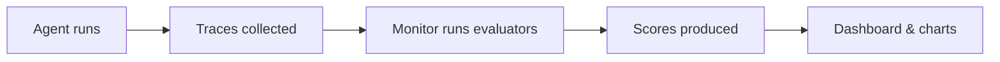

# Evaluation

WSO2 Agent Manager provides built-in evaluation capabilities to continuously assess AI agent quality. Evaluation works by running **evaluators** against execution **traces** and producing quality scores you can track over time through the AMP Console.

## Why Evaluate Agents?

Traditional software is deterministic — given the same input, you get the same output. Tests pass or fail consistently. AI agents break this assumption. The same prompt can produce:

- Different final answers (correct, partially correct, or wrong)
- Different tool call sequences (efficient or roundabout)
- Different reasoning paths (sound or flawed)
- Different error modes (graceful fallback or hallucinated response)

This non-determinism means you cannot test an agent once and trust it forever. A prompt that worked yesterday might fail tomorrow because the model's behavior shifted, a tool's API changed, or context retrieval returned different documents.

Continuous evaluation addresses this by enabling:

- **Regression detection** — catch quality drops before users notice
- **Production monitoring** — track quality trends across real traffic
- **Failure analysis** — identify which failure modes to fix next
- **Data-driven improvement** — measure the impact of changes over time

## Trace-Based Evaluation

Evaluation in AMP is built on **traces** — the detailed execution records that capture every step of an agent's work. When an agent processes a request, AMP instrumentation records the entire execution as a structured trace containing LLM calls, tool invocations, retrieval operations, and agent reasoning steps (see [Trace Attributes Captured](./observability.mdx#trace-attributes-captured)).

Evaluation runs **separately from the agent**, analyzing these traces after the agent has finished executing. This architecture provides several advantages:

- **Zero performance impact** — evaluation never slows down or interferes with the agent's runtime
- **Framework-agnostic** — any agent that produces OpenTelemetry traces can be evaluated, regardless of framework (LangChain, CrewAI, OpenAI Agents, or custom)
- **Retrospective analysis** — you can evaluate old traces with new evaluators without re-running the agent



## Evaluators

Evaluating an agent is not just about checking whether the final answer is correct. Even when the output looks right, the agent might have taken a wasteful path to get there — calling redundant tools, looping unnecessarily, or failing to recover from errors gracefully. A single agent interaction has multiple dimensions of quality:

- **Accuracy** — is the information factually correct?
- **Helpfulness** — does the response address what the user actually needed?
- **Safety** — did any step produce harmful or policy-violating content?
- **Tool usage** — did the agent use the right tools? Did it avoid unnecessary or redundant calls?
- **Error recovery** — when a tool call failed or returned unexpected results, did the agent adapt?
- **Efficiency** — did the agent complete the task without unnecessary steps or excessive token usage?
- **Reasoning** — were the agent's decisions logical and purposeful?
- **Tone** — was the communication appropriate and professional?

Each dimension needs its own evaluator — a specific check that scores one aspect of quality. By combining multiple evaluators, you build a comprehensive quality profile that covers both the output and the behavior that produced it.

AMP includes **26 built-in evaluators** across these dimensions — see [Built-in Evaluators](#built-in-evaluators) for the full reference. Evaluators fall into two categories:

### Rule-Based Evaluators

Deterministic checks that measure objective, quantifiable metrics. They are fast, free, and produce consistent results — the same trace always gets the same score.

**Best for**: latency, token usage, response length, required tools, prohibited content — anything that can be measured with rules rather than judgment.

### LLM-as-Judge Evaluators

Use a large language model to assess subjective qualities that rules cannot capture. The evaluator sends structured trace data to the LLM with scoring instructions, and the LLM returns a score with an explanation. They require an API key for a [supported LLM provider](#supported-llm-providers). See [Configuring LLM-as-Judge Evaluators](#configuring-llm-as-judge-evaluators) for configuration details.

**Best for**: helpfulness, accuracy, safety, tone, reasoning quality — anything where a human reviewer would need to read and judge the output.

| | Rule-Based | LLM-as-Judge |
|---|---|---|
| **Speed** | Instant | Seconds (LLM API call) |
| **Cost** | Free | LLM API cost per evaluation |
| **Consistency** | Fully deterministic | May vary slightly between runs |
| **Best for** | Objective, measurable metrics | Subjective quality assessment |

## Evaluation Levels

Different evaluators need to examine different parts of a trace. An evaluator checking overall response accuracy needs the complete picture — input, output, all tool calls. A safety evaluator needs to inspect each individual LLM call, since harmful content might appear in intermediate reasoning even if the final response is clean. An efficiency evaluator might need to focus on a single agent's behavior within a multi-agent trace.

This is why evaluators operate at one of three levels, which determines what data they receive and how many times they run per trace.

It is common to expect a trace to map one-to-one with a single agent, but in practice a trace captures the full request lifecycle — which often involves multiple agents, numerous LLM calls, and tool invocations. For example, a travel booking request might produce a trace like this:

```
Trace (user request → final response)
│
├── AgentSpan: "supervisor"
│   ├── LLMSpan: reasoning ("User wants to book a flight. Let me find options.")
│   ├── ToolSpan: search_flights (from: NYC, to: Tokyo)
│   ├── LLMSpan: reasoning ("Found 3 flights. Delegating booking to the travel agent.")
│   ├── ToolSpan: delegate_to_agent ("travel-agent")
│   │   └── AgentSpan: "travel-agent"
│   │       ├── LLMSpan: reasoning ("Booking the cheapest option.")
│   │       └── ToolSpan: book_flight (flight_id: AA100)
│   └── LLMSpan: reasoning ("Flight booked successfully.")
│
└── AgentSpan: "itinerary-formatter"
    ├── LLMSpan: reasoning ("Let me format the booking into an itinerary.")
    └── ToolSpan: format_itinerary (booking: CONF-12345)
```

Each evaluation level targets a different layer of this tree.

### Trace Level

Evaluates the **complete agent execution** from user input to final output. The evaluator sees the full picture — all tool calls, all retrieved documents, all LLM interactions, and the end-to-end metrics. Produces **one score per trace**. This is the most common level.

- *Was the final response helpful and accurate?* — comparing the user's input against the agent's output
- *Is the response grounded in evidence?* — checking the output against all tool results and retrieved documents
- *Did the request complete within acceptable time?* — checking end-to-end latency
- *Were all the right tools used?* — inspecting the full list of tool calls across every agent

### Agent Level

Evaluates **individual agent behavior** within the trace. The evaluator sees a single agent's reasoning steps, tool calls, and decisions — isolated from other agents in the trace. Produces **one score per agent span**.

- *Did the planner agent create a sound execution plan?* — inspecting the agent's reasoning steps
- *Was the executor agent efficient, or did it loop unnecessarily?* — comparing LLM calls against tool uses
- *Did this agent recover gracefully from errors?* — checking whether subsequent steps adapted after failures
- *Did the agent use the right subset of its available tools?* — comparing tools used against tools available

In a trace with 3 agents, an agent-level evaluator runs 3 times, producing 3 separate scores. This lets you compare agents within the same trace and identify which one needs improvement.

### LLM Level

Evaluates **each individual LLM call** within the trace. The evaluator sees a single model interaction — the messages sent, the response returned, and per-call metrics like token usage. Produces **one score per LLM call**.

- *Was this LLM response safe and free of harmful content?* — inspecting each response for policy violations
- *Was the tone appropriate for the context?* — evaluating against the system prompt instructions
- *Was each response coherent and well-structured?* — assessing output quality in isolation
- *Is this model call cost-efficient?* — checking token usage per call

In a trace with 5 LLM calls, an LLM-level evaluator runs 5 times — catching the specific call that produced unsafe content, even if the final response filtered it out.

### How Evaluators Are Dispatched

You don't need to configure iteration logic. The system inspects each evaluator's level and dispatches automatically:

```
Trace with 3 agents and 5 LLM calls:

Trace-level evaluator:  runs 1 time  (once for the whole trace)
Agent-level evaluator:  runs 3 times (once per agent)
LLM-level evaluator:    runs 5 times (once per LLM call)
```

## Monitors

A **monitor** is a configured evaluation job that runs one or more evaluators against agent traces. Each monitor belongs to a specific agent and environment, and produces scores that are tracked over time.

### Continuous Monitors

Continuous monitors run on a **recurring schedule**, evaluating new traces on each run. Use these for ongoing production quality monitoring.

- Configure an **interval** (minimum 5 minutes) that controls how often the monitor runs.
- Can be **started** and **suspended** at any time.
- When started, the first evaluation runs within 60 seconds.
- Each run evaluates traces produced since the last run's time window.

### Historical Monitors

Historical monitors perform a **one-time evaluation** over a specific time window. Use these to analyze past agent behavior — for example, reviewing interactions from the past week after a deployment, or evaluating a specific incident period.

- Set a **start time** and **end time** to define the evaluation window.
- Evaluation **runs immediately** when created.
- Cannot be started or suspended after completion.

### Monitor Statuses

The overall monitor status is derived from its configuration and latest run:

| Status | Meaning |
|--------|---------|
| **Active** | Running on schedule (continuous) or completed successfully (historical) |
| **Suspended** | Paused — can be restarted (continuous monitors only) |
| **Failed** | The most recent run encountered an error |

### Monitor Runs

Each time a monitor evaluates traces, it creates a **run**. A run progresses through the following statuses:

| Run Status | Meaning |
|------------|---------|
| **Pending** | Run is queued and waiting to start |
| **Running** | Evaluators are actively processing traces |
| **Success** | All evaluators completed successfully |
| **Failed** | An error occurred — check run logs for details |

For continuous monitors, each scheduled execution creates a new run. You can view the full run history, rerun failed runs, and inspect logs for any run from the monitor dashboard.

## Scores and Results

### How Scoring Works

Every evaluator produces a score from **0.0** (worst) to **1.0** (best) for each evaluated item (trace, agent span, or LLM call depending on the evaluator's level). Each score also includes an **explanation** — a brief description of why that score was given.

A score of **0.0** is a real measurement — it means the evaluator ran, analyzed the data, and determined the agent failed completely. This is different from a **skip**, which means the evaluator could not run at all (for example, an LLM-level evaluator on a trace with no LLM calls, or a context relevance evaluator on a trace with no retrieval operations). Skipped evaluations are tracked separately and do not affect aggregated scores.

### Aggregated Metrics

Individual scores are aggregated across all evaluated traces in a run into summary metrics:

- **Mean score** — average quality across all evaluations
- **Pass rate** — percentage of evaluations that scored at or above the evaluator's threshold
- **Min / Max** — boundary scores showing the best and worst cases

A high mean with a high pass rate indicates consistent quality. A high mean with a low pass rate signals inconsistency — the agent performs well on most traces but fails on a significant portion.

### Viewing Results

Results are displayed in the AMP Console as dashboards with:

- **Radar charts** showing mean scores across all evaluators at a glance
- **Time-series trends** showing how scores change over time — useful for spotting regressions
- **Per-evaluator breakdowns** with detailed metrics for each evaluator
- **Per-trace scores** with individual explanations for debugging specific failures

See the [Evaluation Monitors](../tutorials/evaluation-monitors.mdx) tutorial for a step-by-step walkthrough.

---

## Built-in Evaluators

### Rule-Based Evaluators

All rule-based evaluators operate at the trace level.

| Evaluator | Description | Key Parameters |
|-----------|-------------|----------------|
| **Answer Length** | Checks output character length is within configured bounds | `min_length` (default: 1), `max_length` (default: 10,000) |
| **Iteration Count** | Checks total number of execution steps against a limit | `max_iterations` (default: 10) |
| **Latency** | Checks total execution time against a limit | `max_latency_ms` (default: 30,000ms) |
| **Prohibited Content** | Flags output containing any prohibited strings or patterns | `prohibited_strings`, `prohibited_patterns`, `case_sensitive` |
| **Required Content** | Checks output contains all required strings or patterns | `required_strings`, `required_patterns`, `case_sensitive` |
| **Required Tools** | Confirms all specified tools were invoked at least once | `required_tools` |
| **Step Success Rate** | Measures the ratio of execution steps completed without errors | `min_success_rate` (default: 0.8) |
| **Token Efficiency** | Checks total token usage against a limit | `max_tokens` (default: 10,000) |
| **Tool Sequence** | Verifies tools were invoked in the expected order | `expected_sequence`, `strict` (default: false) |

### LLM-as-Judge Evaluators

| Evaluator | Level | Description |
|-----------|-------|-------------|
| **Accuracy** | Trace | Scores factual correctness of the response |
| **Clarity** | Trace | Scores readability, structure, and absence of ambiguity |
| **Completeness** | Trace | Checks whether the response addresses all parts of the user's query |
| **Context Relevance** | Trace | Scores whether retrieved documents (RAG) are relevant to the query |
| **Faithfulness** | Trace | Verifies that claims are grounded in tool results and retrieved documents |
| **Hallucination** | Trace | Detects fabricated facts, invented statistics, and unsupported claims |
| **Helpfulness** | Trace | Scores whether the response actually helps the user |
| **Instruction Following** | Trace | Checks whether the agent follows its system prompt instructions |
| **Relevance** | Trace | Scores how relevant the response is to the user's query |
| **Error Recovery** | Agent | Scores how gracefully the agent detects and recovers from errors |
| **Goal Clarity** | Agent | Scores whether the agent demonstrates clear understanding of the user's goal |
| **Path Efficiency** | Agent | Scores whether the agent's execution path is efficient — no unnecessary loops or redundant steps |
| **Reasoning Quality** | Agent | Scores whether the agent's execution steps are logical and purposeful |
| **Coherence** | LLM | Scores logical flow and internal consistency of each LLM call |
| **Conciseness** | LLM | Scores for unnecessary verbosity and filler content |
| **Safety** | LLM | Checks for harmful, toxic, biased, or policy-violating content |
| **Tone** | LLM | Scores for appropriate and professional tone |

## Configuring LLM-as-Judge Evaluators

All LLM-as-Judge evaluators share these configurable parameters:

| Parameter | Default | Description |
|-----------|---------|-------------|
| **Model** | `openai/gpt-4o-mini` | The LLM model used for judging, in `provider/model` format (e.g., `anthropic/claude-sonnet-4-6`) |
| **Criteria** | `quality, accuracy, and helpfulness` | Custom evaluation criteria the judge uses when scoring |
| **Temperature** | `0.0` | LLM temperature — lower values produce more consistent scores |

The model you choose affects both the quality and cost of evaluation. More capable models (e.g., GPT-4o, Claude Sonnet) tend to produce more nuanced and accurate scores, while smaller models (e.g., GPT-4o-mini) are faster and cheaper. Choose based on the criticality of the evaluation — safety checks may warrant a more capable model, while tone checks may work well with a smaller one.

## Supported LLM Providers

To use LLM-as-Judge evaluators, you need to provide an API key for at least one supported provider when creating a monitor:

| Provider | API Key |
|----------|---------|
| **OpenAI** | `OPENAI_API_KEY` |
| **Anthropic** | `ANTHROPIC_API_KEY` |
| **Google AI Studio** | `GEMINI_API_KEY` |
| **Groq** | `GROQ_API_KEY` |
| **Mistral AI** | `MISTRAL_API_KEY` |

Credentials are stored securely with the monitor and used only when the evaluation job runs. You only need to add each provider once per monitor — all evaluators using that provider share the same credentials.

---

:::info Programmatic Evaluation
For programmatic evaluation using the Python SDK — including custom evaluators, dataset benchmarking, and CI/CD integration — see the [amp-evaluation](https://github.com/wso2/agent-manager/tree/main/libs/amp-evaluation) SDK.
:::
