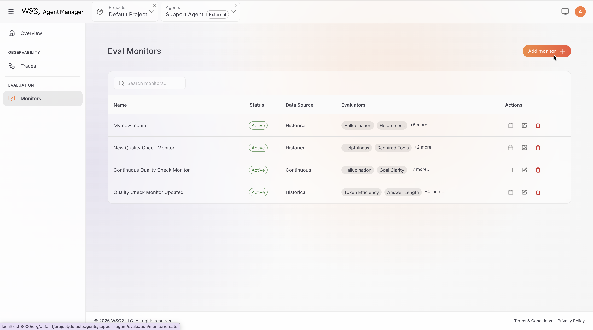
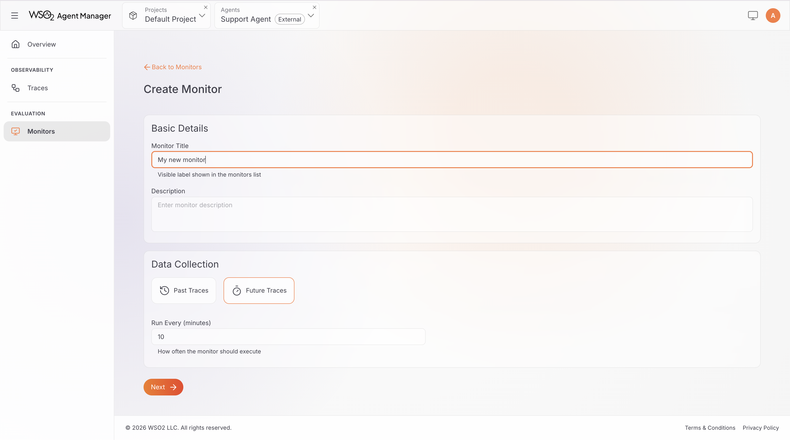
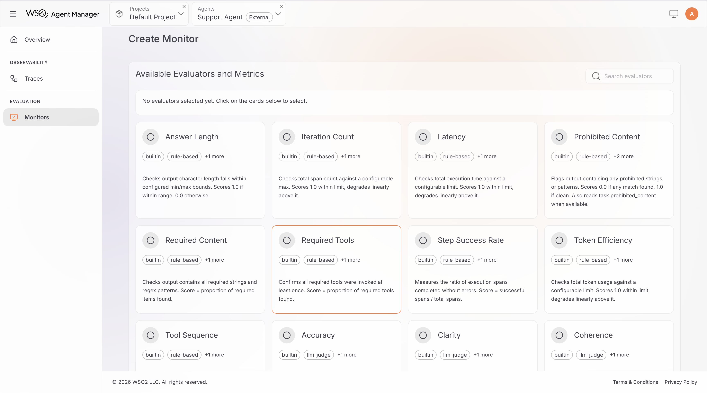
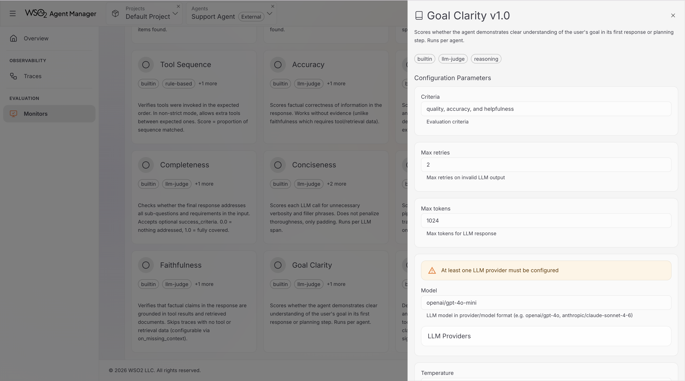
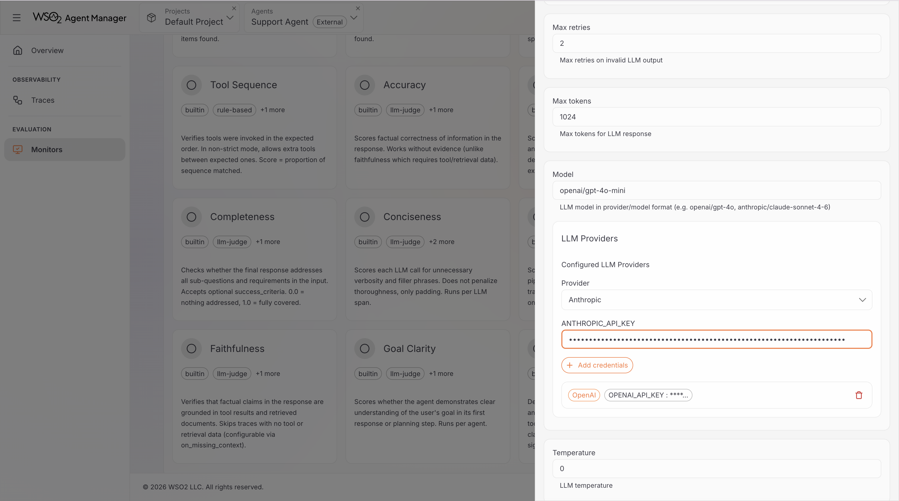
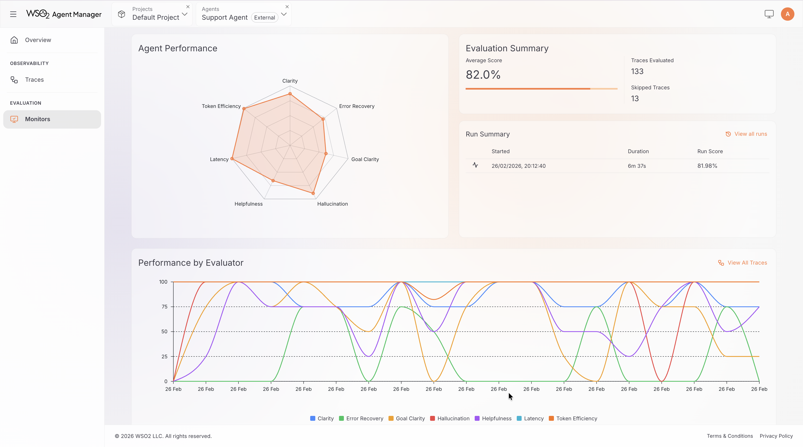
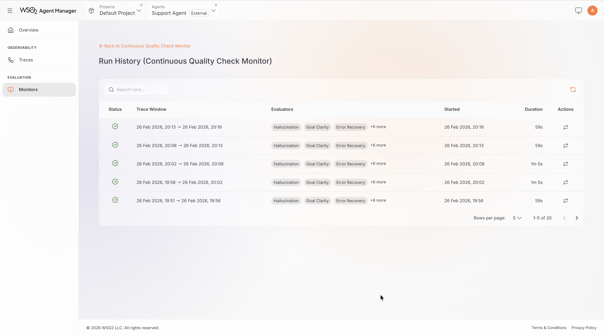
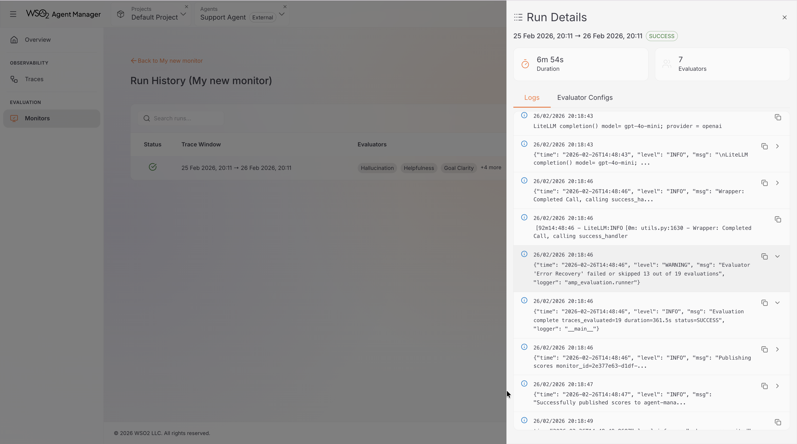

# Evaluation Monitors

This tutorial walks you through creating an evaluation monitor, viewing results, and managing monitors in the AMP Console.

## Prerequisites

- A running AMP instance (see [Quick Start](../getting-started/quick-start.mdx))
- An agent registered in AMP with an active environment
- Agent traces being collected (see [Observe Your First Agent](./observe-first-agent.mdx))
- For LLM-as-Judge evaluators: an API key for a [supported LLM provider](../concepts/evaluation.mdx#supported-llm-providers)

---

## Create a Monitor

### Step 1: Navigate to Evaluation

1. Open the AMP Console and select your agent.
2. Click the **Evaluation** tab.
3. Click **Add Monitor**.

---

### Step 2: Configure Monitor Details

Fill in the monitor configuration:

- **Monitor Title**: A descriptive name for the monitor (e.g., "Production Quality Monitor").
- **Identifier**: Auto-generated from the title. You can customize it — must be lowercase with hyphens, 3–60 characters.
- **Data Collection Type**: Choose one:
  - **Past Traces** — evaluate traces from a specific time window. Set a **Start Time** and **End Time**. The evaluation runs immediately after creation.
  - **Future Traces** — evaluate new traces on a recurring schedule. Set an **interval** in minutes (minimum 5 minutes).

:::tip Choosing a monitor type
Use **Past Traces** when you want to assess historical agent behavior — for example, reviewing last week's interactions after a deployment. Use **Future Traces** for ongoing production quality monitoring.
:::

---

### Step 3: Select and Configure Evaluators

1. Browse the evaluator grid. Each card shows the evaluator name, tags, and a brief description.
2. Click an evaluator card to open its details and configuration.
3. Configure parameters as needed — for example, set `max_latency_ms` for the Latency evaluator, or choose a model for an LLM-as-Judge evaluator.
4. Click **Add Evaluator** to include it in the monitor.
5. Repeat for all evaluators you want to use. You must select at least one.

For a full reference of available evaluators and their parameters, see [Built-in Evaluators](../concepts/evaluation.mdx#built-in-evaluators).

---

### Step 4: Configure LLM Providers (LLM-as-Judge only)

If you selected any LLM-as-Judge evaluators, you need to configure at least one LLM provider. Skip this step if you only selected rule-based evaluators.

1. In the evaluator configuration panel, find the **LLM Providers** section.
2. Select a provider from the dropdown (OpenAI, Anthropic, Google AI Studio, Groq, or Mistral AI).
3. Enter your API key.
4. Click **Add** to save the credentials.

The **model** field on LLM-as-Judge evaluators uses `provider/model` format (e.g., `openai/gpt-4o-mini`, `anthropic/claude-sonnet-4-6`). The available models depend on the providers you have configured.

:::tip
You only need to add each provider once per monitor — all evaluators using that provider share the same credentials.
:::

---

### Step 5: Create the Monitor

Review your configuration and click **Create Monitor**.

- **Historical monitors** start evaluating immediately. Results appear in the dashboard once the run completes.
- **Continuous monitors** start in Active status. The first evaluation runs within 60 seconds, then repeats at the configured interval.

---

## View Monitor Results

After creation, you'll see your monitor in the monitor list. Click a monitor to open its dashboard.

### Dashboard Overview

The monitor dashboard provides several views of your evaluation results:

- **Time Range Selector** — filter results by Last 24 Hours, Last 3 Days, Last 7 Days, or Last 30 Days.
- **Agent Performance Chart** — a radar chart showing mean scores across all evaluators, giving a quick visual summary of agent strengths and weaknesses.
- **Evaluation Summary** — total traces evaluated, skipped traces, and weighted average score.
- **Performance by Evaluator** — a time-series chart showing how each evaluator's score trends over time. Useful for spotting regressions or improvements.

### Run History

The dashboard also shows a history of all evaluation runs. Each run displays:

- **Status**: pending, running, success, or failed
- **Trace window**: the start and end time of traces evaluated
- **Timestamps**: when the run started and completed

You can take actions on individual runs:

- **Rerun** — re-execute the evaluation run.
- **View Logs** — see detailed execution logs for troubleshooting.

### Run Logs

Click **View Logs** on any run to open the log viewer. This displays the application logs from the monitor's evaluation job, useful for diagnosing failed or unexpected runs.

---

## Start and Suspend a Monitor

This applies to **continuous monitors** only.

- **Suspend**: Click the **pause** button in the actions column. The monitor stops running on schedule but retains all configuration and historical results. You can resume it at any time.
- **Start**: Click the **play** button on a suspended monitor. Evaluation resumes within 60 seconds.

:::info
Historical monitors cannot be started or suspended — they run once when created.
:::

---

## Edit a Monitor

1. Click the **edit** (pencil) icon in the monitor list actions column.
2. The monitor configuration wizard opens with the current settings.
3. Update the fields you want to change — display name, evaluators, evaluator parameters, LLM provider credentials, interval (for continuous monitors), or time range (for historical monitors).
4. Click **Save** to apply the changes.

:::info
The monitor type (continuous or historical) cannot be changed after creation.
:::

---

## Delete a Monitor

1. Click the **delete** (trash) icon in the monitor list actions column.
2. Confirm the deletion in the dialog.

Deletion permanently removes the monitor and all its associated run history and scores. This action cannot be undone.
